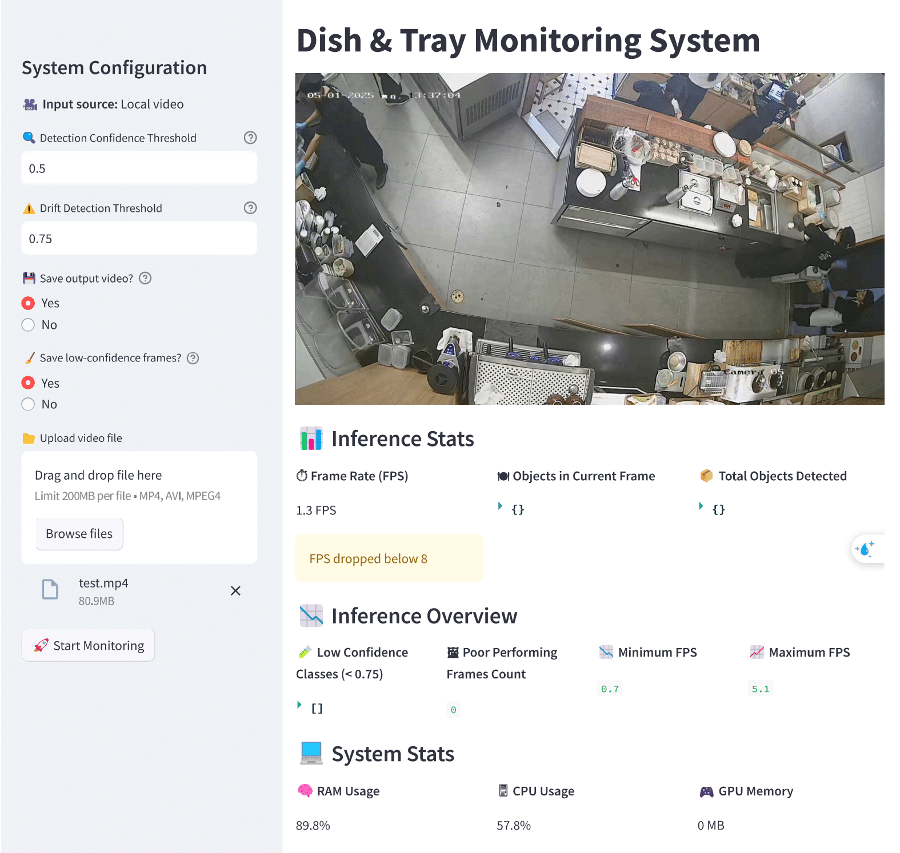

# Dish Tracking System using YOLOv5, DeepSORT, and ResNet101

This project implements a real-time dish tracking and classification system using:

- **YOLOv5** for dish & tray detection
- **DeepSORT** for tracking dishes and trays across frames
- **ResNet101** (fine-tuned) for classifying dish states: `empty`, `kakigori`, `non_empty`

The system is containerized using **Docker Compose** for easy setup and deployment.


Here is an example of the system in action:


---

## 🚀 Features

- ✅ Dish detection using YOLOv5
- ✅ Multi-object tracking using DeepSORT
- ✅ Second-stage classification with a ResNet101 model
- ✅ Real-time inference with FPS, CPU, RAM, GPU usage display
- ✅ Drift handling: saves low-confidence frames
- ✅ Dockerized deployment with a single command

---

## 📦 Installation

### Prerequisites

- [Docker](https://docs.docker.com/get-docker/)
- [Docker Compose](https://docs.docker.com/compose/install/)
- (Optional) NVIDIA GPU + [nvidia-container-toolkit](https://docs.nvidia.com/datacenter/cloud-native/container-toolkit/install-guide.html)

### Setup

```bash
git clone https://github.com/nacon304/Dispatch-Monitoring-System.git
cd Dispatch-Monitoring-System
```

Ensure your trained models are placed in the `weights/` folder:

- `weights/yolov5s_best_200_fixed.pt`
- `weights/resnet101_3.pt`

---

## ▶️ Run the System

```bash
docker-compose up --build
```

The app will process the input video and display annotated results.

---

## 🧪 Output

- Bounding boxes with detection and classification labels
- Tracking ID for each dish
- Realtime system stats (FPS, CPU, RAM, GPU)
- Optional output video saved to `runs/detect/`
- Low-confidence frames saved to `drift_frames/`

---
